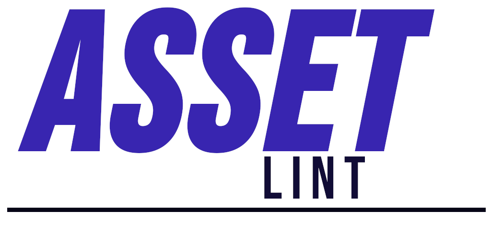

# Asset Lint
Find and fix problems in your assets.

`Asset Lint` staticly analyzes the asset folder to find common problems.

## Reduce the size of the shipped game
With the `--no-duplicates` flag, `asset-lint` finds assets with same
binary content, but different name, or path.  
With `--max-size [size]` it enforces that none of the assets go live
unoptimized.

## No more placeholders
With `--no-placeholder` flag, `asset-lint` will warn if any of your assets matches
the placeholder pattern.

## Constant quality gate - Integrate in CI
Quality first, integrate `asset-lint` into your pipeline. With industry wide stuctured
`.json` report, it works well with most major CI providers.

## Cross-Engine, Cross-platform
By using the `asset_lint_list.json` format, `asset-linter` can work with Bevy, Godot, Unity,
or other game engines.

# Documentation
